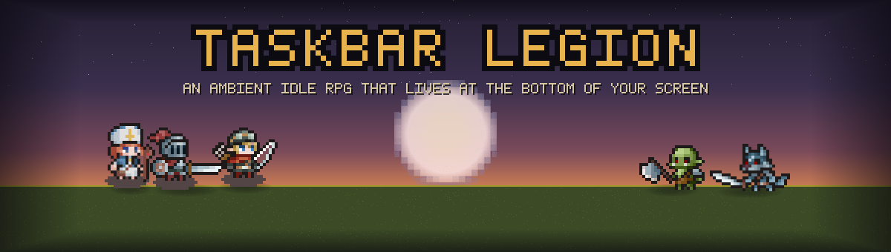
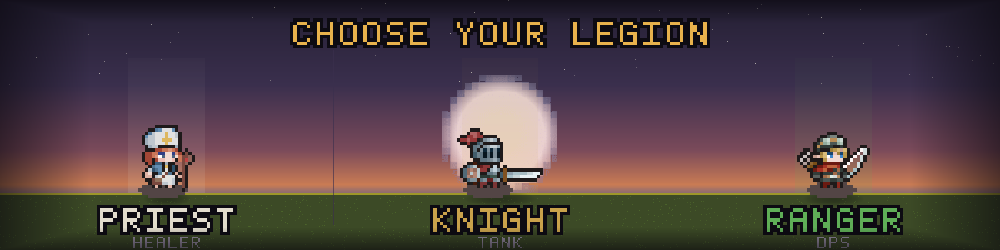
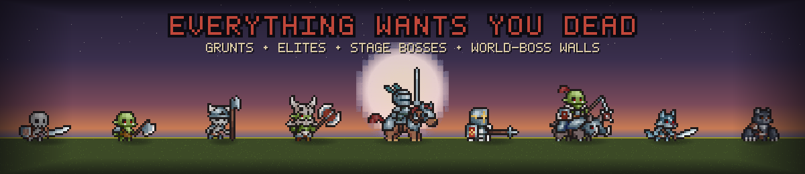

<div align="center">



**A tiny auto-battling RPG that lives at the bottom of your screen.**

*Leave it running. Come back richer.*

</div>

---

## What is this?

**Taskbar Legion** is an idle RPG that plays out in a thin strip along the bottom of your
desktop — quietly, while you do everything else. Your party of three heroes marches ever
rightward, hacking through an endless parade of monsters. You don't control the swinging;
you control the *build*. Pop in now and then to crack open chests, slot a shinier sword,
spend a talent point, and shove your legion a little deeper into the world.

Then you close the panel and let them fight on.

<div align="center">



</div>

## Your legion

Three heroes, one job each. The trio is the whole party — every fight is won or lost on how
well you gear and build them together.

- **🛡️ Knight** — the wall. Soaks the hits so the other two don't have to.
- **🏹 Ranger** — the damage. Marks targets and shreds them from range.
- **✨ Priest** — the lifeline. Heals, shields, and keeps the line standing.

## How it plays

It's a loop, and it's a good one:

1. **They fight on their own.** Heroes auto-attack and fire off abilities as they advance —
   `1-1 → 1-9 → a zone boss at 1-10 → 2-1…` on and on.
2. **Kills fill a bar.** Clear enough of the wave and a **boss** rears up. Beat it to push
   to the next stage.
3. **Loot comes in chests, not corpses.** Monsters drop **chests** (three kinds, limited
   storage so you'll want to open them). Cracking a chest rolls the actual gear.
4. **Gear up.** Every drop is rated **T0 → T8** — from grey junk to iridescent, world-warping
   **Primordial** relics. Better tiers, smarter affixes, and socketed **gems** are what carry
   you forward.
5. **Build your heroes.** Spend **talents** per hero, push a global **tech tree** for your
   economy, and — if you're absurdly lucky — find an ultra-rare **pet**.
6. **Hit a wall. Break it.** Every tenth stage is a **world boss** — a hard gate that says
   *"come back when you're stronger."* So you go farm, gear up, and come back stronger.

<div align="center">



</div>

## The grind, lovingly tuned

The worlds never stop, and they get *meaner* — difficulty accelerates, so the jump from
world 50 to 51 hurts more than 1 to 2 ever did. Your power comes from stacking **gear ×
level × talents × tech**, all multiplying together. Coast on last stage's loot and you'll
stall within a few stages; keep every part of your build moving and the treadmill keeps
rolling — all the way to a roughly year-long climb to the deepest worlds.

It's a game you can check on for thirty seconds or stare at for an hour. Both are correct.

## Lives on your desktop

Taskbar Legion ships as a **transparent, always-on-top desktop overlay** (Windows, macOS,
Linux) — borderless, docked to the bottom of your screen, clicking *through* to whatever's
behind it until you reach for one of its panels. Your heroes, fighting in the margins of
your actual work.

## Play it

Grab an installer for your OS from the [Releases](https://github.com/Nyhz/taskbar-legion/releases)
page (`.dmg` for macOS, `.exe` for Windows, `.AppImage` for Linux).

Building from source:

```bash
npm install
npm run tauri:dev   # run the desktop app
npm run dev         # or just the UI in a browser, for fast iteration
```

No account, no server, no internet. It's 100% offline and your save lives on your own machine.

---

<sub>**Building or hacking on it?** The full design lives in [`SPEC.md`](./SPEC.md); the build
manual and house rules are in [`CLAUDE.md`](./CLAUDE.md), and the `docs/` folder has the
architecture, progression math, and balance numbers. The banners above are composed from the
game's own in-engine pixel sprites (`scripts/gen-banner.mjs`). Built with TypeScript · Vite ·
PixiJS · React · Zustand, wrapped for desktop with Tauri.</sub>
